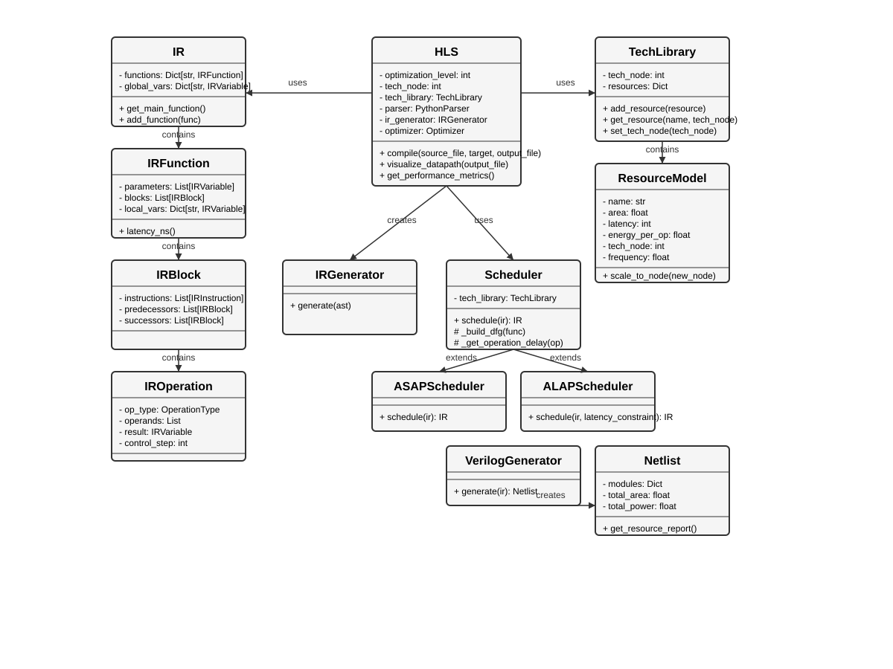

# Python-HLS: High-Level Synthesis from Python to Hardware

DragonX Systems is making Python-HLS source available under the PolyForm Noncommercial License 1.0.0. It is an experimental toolchain for compiling supported Python code into hardware netlists and rapidly exploring the latency, area, power, and resource trade-offs behind them.

Commercial use is not permitted under this license. See [LICENSE](LICENSE) for the full terms.

## Motivation: keep the algorithm close to the hardware conversation

ML models, quantitative research, data-science pipelines, scientific computing, and accelerator prototypes are overwhelmingly expressed in Python. PyTorch, NumPy, JAX, pandas, and their surrounding ecosystems are where models are designed, tested, and iterated.

Asking teams to rewrite those workloads in C++ before they can explore hardware creates a second source of truth:

- The Python model says one thing.
- The C++ HLS model says another.
- The RTL implements a third artifact.

Each translation is a place for behavior, precision, latency, and memory-access assumptions to drift.

Python-HLS explores a different route: preserve the Python-first workflow, make compiler decisions inspectable, and lower supported kernels toward hardware artifacts. It is not an attempt to turn arbitrary Python into perfect silicon. Hardware still requires explicit constraints, fixed shapes, bounded memory, deterministic types, quantization choices, and verification. The goal is to bring those choices closer to the engineers who own the algorithm.

This applies beyond trading:

- **Quantized ML inference:** linear layers, attention primitives, activation functions, and DSP-style operators.
- **Data science:** matrix multiplication, reductions, feature transforms, covariance, and statistics.
- **Scientific computing:** FFTs, filters, PDE/stencil kernels, linear algebra, and simulation workloads.
- **Finance:** signal pipelines, risk calculations, pricing kernels, and market-data processing.
- **Edge systems:** sensor fusion, vision preprocessing, communications, and control.

The experimental PyTorch FX frontend imports a model graph and preserves operation and tensor metadata as a first step toward lowering hardware-friendly kernels. Python-to-Verilog keeps the algorithm close to its original workflow while exposing the hardware trade-offs: latency, area, power, memory, scheduling, and generated RTL.

## Features

- Convert standard Python code to hardware descriptions
- Bounded NumPy frontend: lower fixed-shape NumPy kernels (elementwise, reductions, matmul, activations) into hardware RTL without writing manual C++ models (see [NUMPY_FRONTEND.md](docs/NUMPY_FRONTEND.md))
- Schedule operations using ASAP, ALAP, or list scheduling algorithms
- Allocate hardware resources and bind operations to resources
- Analyze design at different technology nodes (45nm, 28nm, 16nm, 7nm, etc.)
- Run fast, technology-library-driven design-space exploration (DSE) using supplied resource-characterization numbers
- Visualize datapaths, scheduled datapaths, control flow, and netlist microarchitecture
- Generate early estimates for area, power, energy, and latency

## HLS Landscape

This is a workflow comparison, not a benchmark or a quality-of-results comparison. Tool support and licensing change over time; follow the linked project documentation for current details.

| Project | Primary source model | Output / downstream flow | Where it is strongest | Key distinction from Python-HLS |
|---|---|---|---|---|
| **Python-HLS** | Supported general Python; PyTorch FX qualified kernel lowering | Verilog or VHDL; optional GPU-OpenLane handoff | Inspectable Python-to-IR flow, technology-library-driven DSE, PyTorch FX lowering, and scheduling/allocation visualization | Bounded subset of PyTorch kernels; arbitrary model synthesis is out-of-scope, and PPA estimates require physical calibration. |
| [HeteroCL](https://vast.cs.ucla.edu/software/heterocl) | Python-based hardware DSL | LLVM or C-HLS FPGA backends | Data-centric accelerator design with explicit compute, datatype, and memory customization | A dedicated DSL and accelerator scheduling model rather than a general-Python frontend. |
| [XLS](https://google.github.io/xls/) | DSLX; experimental C++ frontend | Verilog/SystemVerilog | Strongly typed, hardware-oriented dataflow IR; pipelined functions and concurrent processes | A purpose-built hardware language/IR rather than Python. XLS itself describes the project as experimental. |
| [LegUp HLS](https://download-soc.microsemi.com/FPGA/HLS-EAP/docs/legup-2021.1-docs/userguide.html) | C/C++ | Verilog for FPGA flows | FPGA-oriented C/C++ HLS, loop pipelining, memory partitioning, and standard interface support | Mature C/C++ workflow; Python-HLS prioritizes Python-originated algorithms and transparent early compiler artifacts. |
| [Cadence Stratus HLS](https://www.cadence.com/en_US/home/resources/datasheets/stratus-high-level-synthesis-ds.html) | SystemC, C/C++, MATLAB | Production ASIC, SoC, and FPGA RTL flows | Production QoR, implementation-flow integration, advanced pipelining, hierarchy, and verification | Commercial production platform; Python-HLS is not feature- or QoR-parity with Stratus. |

Python-HLS is most useful when the algorithm already lives in Python—for example, in quantitative research, DSP, scientific computing, data science, or an ML model workflow—and the goal is to begin exploring hardware trade-offs without first maintaining a separate C++ model.

## Class Diagram

The following class diagram illustrates the key components of the Python-HLS system and their relationships:



The diagram shows the main classes:
- **HLS**: The core compiler that coordinates the entire compilation process
- **IR**: The intermediate representation system with IRFunction, IRBlock, and IROperation
- **TechLibrary**: Models for different hardware resources across technology nodes
- **Scheduler**: Abstract scheduler with concrete implementations (ASAP, ALAP)
- **Backend**: Generators for Verilog/VHDL and the resulting Netlist

## Installation

```bash
# Clone the repository
git clone https://github.com/DragonX-Systems/python-hls.git
cd python-hls

# Install in development mode
pip install -e .
```

## Usage

### Command-line Interface

Compile a Python function to hardware:

```bash
python -m python_hls.cli compile examples/gcd.py
```

Verify refactor equivalence (functional, cycle-accurate, or bit-exact):

```bash
python -m python_hls.cli verify-equivalence examples/gcd.py examples/gcd_refactored.py
```

Validate semantics (strict mode: no global state, side effects):

```bash
python -m python_hls.cli validate my_pipeline.py --strict
```

Compile a cycle-accounted hardware pipeline with standard interfaces:

```bash
python -m python_hls.cli compile-pipeline examples/mac.py --ii 1 --depth 3 --interface axis -o mac_axis.v
```

Co-simulate and verify pipeline throughput, backpressure stalls, and bubbles with Verilator:

```bash
python -m python_hls.cli verify-pipeline examples/mac.py --ii 1 --depth 3 --interface axis --test-stalls --test-bubbles
```

See [docs/PIPELINE_AND_INTERFACES.md](docs/PIPELINE_AND_INTERFACES.md) for full architecture, capability matrix, and protocol specifications.

Analyze for different technology nodes:

```bash
python -m python_hls.cli analyze examples/gcd.py --tech-nodes 45,28,16,7
```

### Bounded NumPy Hardware Kernels

You can compile fixed-shape NumPy functions directly to hardware RTL using `@numpy_kernel` and `HLS.compile_numpy()`:

```python
import numpy as np
from python_hls import HLS, numpy_kernel

@numpy_kernel(
    shapes={"a": (16,), "b": (16,)},
    dtypes={"a": "int32", "b": "int32"}
)
def vector_add(a, b):
    return a + b

hls = HLS(optimization_level=1, tech_node=45)
netlist, logs = hls.compile_numpy(vector_add, output_file="vector_add.v")
```

See [NUMPY_FRONTEND.md](docs/NUMPY_FRONTEND.md) and [`examples/numpy_vector_add.py`](examples/numpy_vector_add.py) for more details.

Run representative ML, data-science, and finance workload benchmarks:

```bash
# Run quick compilation and reference equivalence across all workloads
python -m python_hls.cli benchmark --domain all --tier quick

# Run full multi-node PPA exploration (45nm, 28nm, 16nm, 7nm) and emit RTL
python -m python_hls.cli benchmark --domain all --tier dse
```

See [BENCHMARKS.md](docs/BENCHMARKS.md) for detailed workload specifications, shapes, dtypes, hardware assumptions, and reproducible PPA results.

Compile a PyTorch model directly to Verilog:

```bash
python -m python_hls.cli compile-torch examples/pytorch_linear_relu.py --input-shapes "4" -o linear_relu.v
```
### Fast DSE with External Technology Libraries

The `analyze` command compiles a kernel across technology nodes, produces an area/power/latency comparison, and can use supplied resource-characterization numbers instead of relying only on the built-in illustrative models. Compiler decisions and their resulting datapath, schedule, control-flow, and netlist views remain inspectable.

Pass a JSON library to `compile` or `analyze`:

```bash
python -m python_hls.cli analyze examples/gcd.py \
  --tech-nodes 45,28,16,7 \
  --tech-library examples/technology_libraries/example_45nm.json
```

Each entry overrides the corresponding resource model at its technology node. Unspecified resources use the built-in model; when an exact node is absent, the model is scaled as an early estimate.

```json
{
  "tech_node": 45,
  "resources": [{
    "name": "Adder_32bit",
    "area": 180.0,
    "latency": 1,
    "energy_per_op": 0.8,
    "leakage_power": 8.0,
    "tech_node": 45,
    "frequency": 1000.0
  }]
}
```

`area` is in µm², `energy_per_op` in pJ, `leakage_power` in µW, and `frequency` in MHz. These models support rapid architectural comparison; characterize and calibrate them against synthesis and physical-implementation reports before making implementation decisions.

### Python API

```python
from python_hls import HLS

# Create an HLS compiler instance
hls = HLS(optimization_level=1, tech_node=45)

# Compile a Python file to hardware (returns netlist, synthesis_logs)
netlist, logs = hls.compile("examples/gcd.py", target="verilog", output_file="gcd.v")

# Get performance metrics
metrics = hls.get_performance_metrics()
print(f"Area: {metrics['total_area']:.2f} μm²")
print(f"Power: {metrics['total_power']:.2f} mW")
```

For the Python API, load the same external library and pass it to `HLS`:

```python
from python_hls import HLS
from python_hls.tech import TechLibrary

library = TechLibrary.from_json("examples/technology_libraries/example_45nm.json")
hls = HLS(optimization_level=1, tech_node=45, tech_library=library)
```

### PyTorch FX Qualified Kernel Lowering & RTL Generation

Python-HLS supports qualified lowering of statically bounded PyTorch models via PyTorch FX tracing. Lowerable operations include elementwise arithmetic (`+`, `-`, `*`, `/`), matrix multiplication (`torch.matmul`), linear layers (`nn.Linear`), activations (`nn.ReLU`, `torch.clamp`, `nn.Hardtanh`), and reductions (`torch.sum`, `torch.mean`).

Install with PyTorch ML extras:

```bash
pip install -e '.[ml]'
```

Compile directly from Python:

```python
import torch
import torch.nn as nn
from python_hls.frontend.torch_fx import compile_torch_model

class TinyMLP(nn.Module):
    def __init__(self):
        super().__init__()
        self.fc = nn.Linear(4, 2)
        self.relu = nn.ReLU()

    def forward(self, x):
        return self.relu(self.fc(x))

model = TinyMLP().eval()
x = torch.randn(4)

# Compile PyTorch FX model to Verilog RTL netlist
netlist, graph = compile_torch_model(model, [x], target="verilog", output_file="mlp.v")
print(f"Generated modules: {list(netlist.modules.keys())}")
```

Or using the CLI:

```bash
python -m python_hls.cli compile-torch examples/pytorch_linear_relu.py --input-shapes "4" -o linear_relu.v
```

See [docs/PYTORCH_FX_LOWERING.md](docs/PYTORCH_FX_LOWERING.md) for detailed specifications on supported operators, static shapes, quantization types, memory interfaces, and diagnostic errors.

### Demo Kernels (Trading Firms)

Kernels trading engineers care about—signal filters, linear algebra, latency-critical paths:

| Kernel | Use Case | Command |
|--------|----------|---------|
| GCD | Control flow, refactor safety | `python -m python_hls.cli compile demos/trading/gcd.py` |
| FIR filter | Signal pipelines, feed handlers | `python -m python_hls.cli compile demos/trading/fir_filter.py` |
| Dot product | Tick-to-trade, latency-critical | `python -m python_hls.cli compile demos/trading/dot_product.py` |
| Matrix multiply | Factor models, linear algebra | `python -m python_hls.cli compile demos/trading/matrix_multiply_simple.py` |
| EMA | Technical indicators (MACD, RSI) | `python -m python_hls.cli compile demos/trading/ema.py` |
| MACD | Momentum indicator (EMA-based) | `python -m python_hls.cli compile demos/trading/macd.py` |
| RSI | Relative strength index | `python -m python_hls.cli compile demos/trading/rsi.py` |
| FFT (32pt) | Spectral analysis, cycle detection | `python -m python_hls.cli compile demos/trading/fft.py` |
| Covariance | Portfolio risk, factor models | `python -m python_hls.cli compile demos/trading/covariance.py` |
| Bellman-Ford | Arbitrage detection, shortest path | `python -m python_hls.cli compile demos/trading/bellman_ford.py` |

**Demo status:**

| Kernel | Compiles | RTL Verified |
|--------|----------|---------------|
| GCD | ✓ | ✓ |
| EMA | ✓ | ✓ |
| FIR, Dot product, Matrix mult, MACD, RSI, FFT | ✓ | Compiles |
| Covariance, Bellman-Ford | ✓ | Compiles |

See [docs/TRADING_QUICKSTART.md](docs/TRADING_QUICKSTART.md) and [docs/SUPPORTED_PYTHON.md](docs/SUPPORTED_PYTHON.md). Also [docs/TRADING_KERNELS_RESEARCH.md](docs/TRADING_KERNELS_RESEARCH.md) for FPGA-accelerated algorithm research.

## Physical Implementation Handoff

Python-HLS emits RTL that can be handed to an RTL-to-GDS flow for implementation measurements. The companion GPU-OpenLane project provides an optional OpenLane/OpenROAD-based path for synthesis, place-and-route, static timing analysis, DRC, and activity-based power estimation.

Set `GPU_OPENLANE_ROOT` to the GPU-OpenLane checkout, then provide the generated RTL, its top module, an SDC constraints file, and a characterized Liberty library:

```bash
export GPU_OPENLANE_ROOT=/path/to/gpu-openlane

python "$GPU_OPENLANE_ROOT/eda_pipeline.py" \
  --rtl gcd.v \
  --top gcd \
  --lib /path/to/sky130.lib \
  --sdc /path/to/design.sdc \
  --output implementation/gcd
```

This is an optional downstream handoff, not a substitute for validating the generated RTL or a claim of foundry signoff. Use the reports from the implementation flow to calibrate and replace Python-HLS's early resource-model estimates.

## Future Work

- **Qualified constraint-driven pipelining:** support initiation-interval targets, stalls, draining, and bubbles with cycle-accounted RTL and regression qualification.
- **Formal equivalence:** add a supported formal flow for source/RTL and RTL/netlist equivalence, with clear proof assumptions and counterexamples.
- **Production interfaces and composition:** add verified standard interfaces, hierarchical modules, multi-clock and CDC handling, and robust memory-interface flows.
- **Calibrated PPA loop:** automate the GPU-OpenLane handoff and feed synthesis, timing, power, and physical-design reports back into design-space exploration.
- **ML and data-science lowering:** lower qualified PyTorch FX graphs into tensor-aware HLS IR, starting with quantized linear algebra and elementwise kernels.

## Example

Input Python code:
```python
def gcd(a, b):
    while b:
        a, b = b, a % b
    return a
```

This will be converted to an equivalent hardware implementation with:

1. Datapath visualization showing operations, variables, and data flow
2. Scheduled datapath showing operation timing
3. Control flow visualization
4. Resource allocation report
5. Performance metrics for the selected technology node

## Advanced Features

### Scheduling Options

- **ASAP**: Schedule operations as soon as possible
- **ALAP**: Schedule operations as late as possible
- **List**: Schedule with resource constraints

### Loop Unrolling

Python-HLS supports loop unrolling to increase parallelism in hardware implementations. There are two ways to specify loop unrolling:

#### 1. Pragma-based Loop Unrolling

Add pragmas directly in your Python code to specify unrolling:

```python
# pragma loop_count 8  # Hint about the loop iteration count
# pragma unroll 2      # Partial unrolling with factor 2
for i in range(N):
    # Loop body
    
# pragma loop_count 16
# pragma unroll full   # Full unrolling of the loop
for j in range(M):
    # Loop body
```

#### 2. API-based Loop Unrolling

Programmatically control loop unrolling using the HLS API:

```python
# Compile the code first
hls = HLS(optimization_level=3)  # Level 3 enables loop unrolling
netlist = hls.compile("my_function.py")

# Apply partial unrolling to the first loop in the function with factor 4
hls.enable_loop_unrolling("function_name", loop_index=0, unroll_factor=4)

# Apply full unrolling to the second loop in the function
hls.enable_loop_unrolling("function_name", loop_index=1, full_unroll=True)

# Get a report on loop unrolling status
unroll_report = hls.get_loop_unrolling_report()
print(unroll_report)

# Disable unrolling if needed
hls.disable_loop_unrolling("function_name", loop_index=0)
```

Loop unrolling increases hardware resource usage in exchange for improved performance through parallelism. The allocation report will show increased resource usage based on the unrolling factor.

### Optimization Levels

- **Level 0**: No optimizations
- **Level 1**: Basic optimizations (constant folding, dead code elimination)
- **Level 2**: Medium optimizations (adds common subexpression elimination, loop-invariant code motion)
- **Level 3**: Aggressive optimizations (adds function inlining, loop unrolling, resource sharing)

### Hardware Metrics

The tool provides detailed hardware metrics including:

- **Area breakdown** by resource type (ALUs, multipliers, registers, etc.)
- **Power analysis** showing dynamic and static power components
- **Energy efficiency** metrics for evaluating design trade-offs
- **Performance metrics** including latency, throughput, and critical path

## Commercial Edition

Python-HLS is source-available for noncommercial use under the PolyForm Noncommercial License 1.0.0. For an advanced commercial version, contact [contact@dragonx-systems.com](mailto:contact@dragonx-systems.com).
