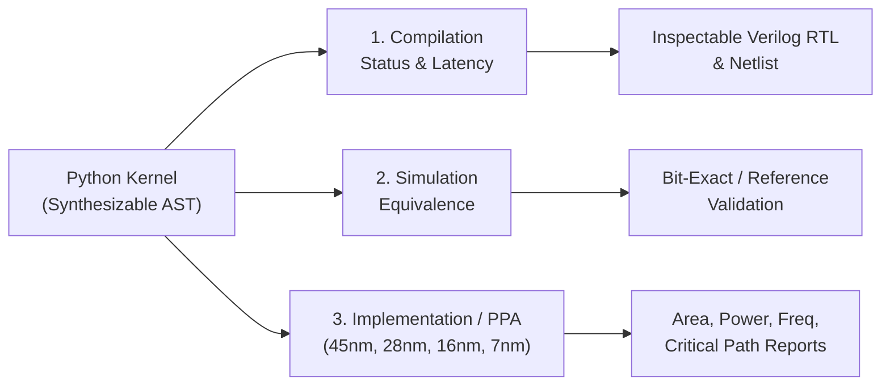

# Representative Workload Benchmarks

Demonstrate Python-HLS on realistic, representative workloads that practitioners run across **Quantized Machine Learning**, **Data Science & Scientific Computing**, and **Quantitative Finance**, rather than simple toy kernels.

---

## 1. Scope & Methodology

Practitioners evaluating High-Level Synthesis tools require transparent, inspectable evidence across three distinct dimensions. Python-HLS explicitly isolates each dimension and **never collapses them into a single score**:



1. **Compilation Success**: Proves that the restricted Python AST dialect parses, generates typed Intermediate Representation (IR), schedules operations, and emits valid Verilog RTL netlists.
2. **Simulation Equivalence**: Proves that the hardware design produces functionally identical numerical results to the Python algorithmic reference across defined test vectors.
3. **Physical Implementation & PPA (DSE)**: Evaluates early design-space exploration estimates (Area $\mu\text{m}^2$, Power $\text{mW}$, Latency $\text{ns}$, Clock $\text{MHz}$, and Critical Path $\text{ns}$) across standardized foundry technology nodes ($45\text{nm}$, $28\text{nm}$, $16\text{nm}$, $7\text{nm}$).

---

## 2. Workload Catalog

The benchmark suite includes nine representative workloads spanning three domains:

### Machine Learning (ML) Inference
- **`mlp_layer`** (Quantized Multi-Layer Perceptron): $4\times 4$ matrix-vector multiplication with bias accumulation and ReLU activation ($\mathbf{y} = \max(0, \mathbf{W}\mathbf{x} + \mathbf{b})$). Emulates dense layers in quantized edge neural networks.
- **`attention_slice`** (Scaled Dot-Product Attention Primitive): Computes query-key scores ($\mathbf{Q} \cdot \mathbf{K}^T // 2$), integer sum normalization, and value context projection ($\mathbf{A} \cdot \mathbf{V}$). Standard primitive in transformer architectures.
- **`conv1d_quant`** (1D Temporal Convolution with Residual): $16$-sample sequence convolved with a $4$-tap kernel, residual skip-connection from tap index 1, and ReLU clamping. Emulates 1D convolutional feature extraction in audio and time-series analysis.

### Data Science & Scientific Computing
- **`covariance_matrix`** (Multi-Feature Sample Covariance): Computes a $4\times 4$ symmetric sample covariance matrix across $4$ features and $8$ observation samples with two-stage mean reduction and cross-deviation accumulation.
- **`zscore_normalize`** (Feature Standardization): Mean reduction, variance sum, Newton-Raphson integer square root ($6$ iterations), and normalized feature scaling by $1000$.
- **`fir_filter_2d`** (2D Spatial Sensor/Image Filter): $6\times 6$ sensor image filtered with a $3\times 3$ convolution stencil kernel (Gaussian smoothing or Laplacian edge detection), producing a $4\times 4$ valid spatial output grid.

### Quantitative Finance
- **`black_scholes_lattice`** (Cox-Ross-Rubinstein Option Pricing): $4$-step binomial lattice tree evaluating European call option fair values via backwards induction roll-back of risk-neutral discounted expectations.
- **`vwap_orderbook`** (5-Level Limit Order Book Market Signals): Computes total bid/ask volume, cumulative notional values, mid-quote Volume-Weighted Average Price (VWAP), and top-of-book micro-price:
  $$\text{Micro-Price} = \frac{P_{\text{bid}, 0} \cdot Q_{\text{ask}, 0} + P_{\text{ask}, 0} \cdot Q_{\text{bid}, 0}}{Q_{\text{bid}, 0} + Q_{\text{ask}, 0}}$$
- **`portfolio_var`** (Parametric Value-at-Risk & Volatility): Computes portfolio variance quadratic form ($\mathbf{w}^T \mathbf{\Sigma} \mathbf{w}$), Newton-Raphson integer square root volatility, and $99\%$ VaR scaling ($2.326 \cdot \sigma$).

---

## 3. Pinned Workload Specifications & Hardware Assumptions

| Domain | Workload | Entry Function | Shapes & Dtypes | Quantization | Hardware Assumptions |
| :--- | :--- | :--- | :--- | :--- | :--- |
| **ML** | `mlp_layer` | `mlp_layer` | `x`: [4]<br>`w`: [4, 4]<br>`b`: [4]<br>`y`: [4] | int8 symmetric weights/inputs with 32-bit accumulators | • Fixed static shapes: 4x4 matrix and 4-element vectors<br>• Sequential or pipelined MAC schedule<br>• Zero-latency ReLU clamp |
| **ML** | `attention_slice` | `attention_slice` | `q`: [4]<br>`k`: [4, 4]<br>`v`: [4, 4]<br>`out`: [4] | Integer scaled fixed-point with sqrt(d_k)=2 factor | • Fixed 4-element head dimension and 4-token sequence slice<br>• Integer sum normalization instead of exponential softmax<br>• Sequential or pipelined inner-product dot product |
| **ML** | `conv1d_quant` | `conv1d_quant` | `x`: [16]<br>`weights`: [4]<br>`bias`: scalar<br>`out`: [13] | 8-bit integer weights/activations with 32-bit internal accumulation | • Fixed length 16 input buffer, static 4-tap filter<br>• Linear sliding window shift register / memory indexing<br>• Zero-latency skip-connection addition and ReLU clamp |
| **DATA_SCIENCE** | `covariance_matrix` | `covariance_matrix` | `data`: [4, 8]<br>`cov`: [4, 4] | Scaled integer arithmetic with integer division by (N-1)=7 | • Fixed 4x8 observations array<br>• Two-stage reduction datapath (mean reduction followed by cross-deviation products)<br>• Direct BRAM / register bank addressing |
| **DATA_SCIENCE** | `zscore_normalize` | `zscore_normalize` | `x`: [8]<br>`out`: [8] | Scaled integer arithmetic with fixed-point scale factor 1000 | • Fixed 8-element feature vector<br>• Hardware divider sharing between variance and square root<br>• Bound loop iterations (6 cycles) for Newton-Raphson convergence |
| **DATA_SCIENCE** | `fir_filter_2d` | `fir_filter_2d` | `img`: [6, 6]<br>`kernel`: [3, 3]<br>`out`: [4, 4] | Quantized integer filter weights with right-shift / 16 normalization | • Fixed 6x6 image matrix with line buffer access<br>• Static 3x3 convolution window unrollable into parallel DSP multipliers<br>• Valid boundary mode |
| **FINANCE** | `black_scholes_lattice` | `black_scholes_lattice` | `s_nodes`: [5]<br>`strike`: scalar<br>`q_up`: scalar<br>`q_down`: scalar<br>`discount_denom`: scalar | Basis-point integer fixed-point with scaled probability weights | • Fixed 4-step tree structure with static loop bounds<br>• Sequential or pipelined backwards induction systolic pipeline<br>• Deterministic ALU and multiplier scheduling |
| **FINANCE** | `vwap_orderbook` | `vwap_orderbook` | `bid_prices`: [5]<br>`bid_sizes`: [5]<br>`ask_prices`: [5]<br>`ask_sizes`: [5] | Integer price-time tick representation with basis-point precision | • Fixed 5-level market depth snapshot directly streamable<br>• Parallel multiply-accumulate trees for notional calculations<br>• Deterministic divider units for VWAP ratios |
| **FINANCE** | `portfolio_var` | `portfolio_var` | `weights`: [4]<br>`cov_matrix`: [4, 4] | Basis-point integer scaling with 8-iteration Newton-Raphson integer square root | • Fixed 4-asset portfolio with statically bound double loop<br>• Hardware sharing of divider unit for integer square root<br>• Low-latency single-cycle MAC datapath |

---

## 4. Benchmark Results

### 4.1 Compilation & Simulation Equivalence

All workloads are compiled using `HLS(optimization_level=1, tech_node=45)` and validated against Python reference implementations with test vectors:

| Domain | Workload | Compilation Status | Op Count | Latency (Cycles) | Equivalence Status | Test Vectors | RTL Output |
| :--- | :--- | :---: | :---: | :---: | :---: | :---: | :--- |
| **ML** | `mlp_layer` | ✅ PASS | 10 | 257 | ✅ PASS | 3/3 | [`mlp_layer.v`](../benchmarks/reports/rtl/mlp_layer.v) |
| **ML** | `attention_slice` | ✅ PASS | 24 | 1193 | ✅ PASS | 2/2 | [`attention_slice.v`](../benchmarks/reports/rtl/attention_slice.v) |
| **ML** | `conv1d_quant` | ✅ PASS | 11 | 820 | ✅ PASS | 2/2 | [`conv1d_quant.v`](../benchmarks/reports/rtl/conv1d_quant.v) |
| **DATA_SCIENCE** | `covariance_matrix` | ✅ PASS | 19 | 4268 | ✅ PASS | 2/2 | [`covariance_matrix.v`](../benchmarks/reports/rtl/covariance_matrix.v) |
| **DATA_SCIENCE** | `zscore_normalize` | ✅ PASS | 21 | 758 | ✅ PASS | 3/3 | [`zscore_normalize.v`](../benchmarks/reports/rtl/zscore_normalize.v) |
| **DATA_SCIENCE** | `fir_filter_2d` | ✅ PASS | 14 | 3590 | ✅ PASS | 2/2 | [`fir_filter_2d.v`](../benchmarks/reports/rtl/fir_filter_2d.v) |
| **FINANCE** | `black_scholes_lattice` | ✅ PASS | 19 | 315 | ✅ PASS | 3/3 | [`black_scholes_lattice.v`](../benchmarks/reports/rtl/black_scholes_lattice.v) |
| **FINANCE** | `vwap_orderbook` | ✅ PASS | 27 | 176 | ✅ PASS | 2/2 | [`vwap_orderbook.v`](../benchmarks/reports/rtl/vwap_orderbook.v) |
| **FINANCE** | `portfolio_var` | ✅ PASS | 16 | 419 | ✅ PASS | 3/3 | [`portfolio_var.v`](../benchmarks/reports/rtl/portfolio_var.v) |

### 4.2 Multi-Node Implementation & PPA Exploration (DSE)

Early design-space exploration estimates across characterized foundry technology nodes ($45\text{nm}$, $28\text{nm}$, $16\text{nm}$, and $7\text{nm}$):

| Domain | Workload | Node | Area ($\mu\text{m}^2$) | Power (mW) | Latency (ns) | Clock (MHz) | Critical Path (ns) |
| :--- | :--- | :---: | :---: | :---: | :---: | :---: | :---: |
| ML | `mlp_layer` | **45nm** | 12648.0 | 24.07 | 257.0 | 1000 | 1.000 |
| ML | `mlp_layer` | **28nm** | 5363.6 | 17.68 | 217.7 | 1181 | 0.847 |
| ML | `mlp_layer` | **16nm** | 2973.7 | 12.94 | 188.5 | 1364 | 0.733 |
| ML | `mlp_layer` | **7nm** | 934.7 | 8.71 | 161.4 | 1592 | 0.628 |
| ML | `attention_slice` | **45nm** | 17652.0 | 133.42 | 1193.0 | 1000 | 1.000 |
| ML | `attention_slice` | **28nm** | 7485.6 | 98.00 | 1010.5 | 1181 | 0.847 |
| ML | `attention_slice` | **16nm** | 4150.2 | 71.74 | 874.8 | 1364 | 0.733 |
| ML | `attention_slice` | **7nm** | 1304.5 | 48.06 | 749.2 | 1592 | 0.628 |
| ML | `conv1d_quant` | **45nm** | 12648.0 | 24.07 | 820.0 | 1000 | 1.000 |
| ML | `conv1d_quant` | **28nm** | 5363.6 | 17.68 | 694.5 | 1181 | 0.847 |
| ML | `conv1d_quant` | **16nm** | 2973.7 | 12.94 | 601.3 | 1364 | 0.733 |
| ML | `conv1d_quant` | **7nm** | 934.7 | 8.71 | 515.0 | 1592 | 0.628 |
| Data Science | `covariance_matrix` | **45nm** | 17652.0 | 133.42 | 4268.0 | 1000 | 1.000 |
| Data Science | `covariance_matrix` | **28nm** | 7485.6 | 98.00 | 3615.0 | 1181 | 0.847 |
| Data Science | `covariance_matrix` | **16nm** | 4150.2 | 71.74 | 3129.7 | 1364 | 0.733 |
| Data Science | `covariance_matrix` | **7nm** | 1304.5 | 48.06 | 2680.4 | 1592 | 0.628 |
| Data Science | `zscore_normalize` | **45nm** | 17916.0 | 136.68 | 758.0 | 1000 | 1.000 |
| Data Science | `zscore_normalize` | **28nm** | 7597.5 | 100.39 | 642.0 | 1181 | 0.847 |
| Data Science | `zscore_normalize` | **16nm** | 4212.2 | 73.49 | 555.8 | 1364 | 0.733 |
| Data Science | `zscore_normalize` | **7nm** | 1324.0 | 49.24 | 476.0 | 1592 | 0.628 |
| Data Science | `fir_filter_2d` | **45nm** | 17452.0 | 132.19 | 3590.0 | 1000 | 1.000 |
| Data Science | `fir_filter_2d` | **28nm** | 7400.8 | 97.09 | 3040.7 | 1181 | 0.847 |
| Data Science | `fir_filter_2d` | **16nm** | 4103.1 | 71.08 | 2632.5 | 1364 | 0.733 |
| Data Science | `fir_filter_2d` | **7nm** | 1289.7 | 47.62 | 2254.6 | 1592 | 0.628 |
| Finance | `black_scholes_lattice` | **45nm** | 28216.0 | 141.06 | 331.6 | 950 | 1.053 |
| Finance | `black_scholes_lattice` | **28nm** | 11965.4 | 103.60 | 280.8 | 1122 | 0.892 |
| Finance | `black_scholes_lattice` | **16nm** | 6633.9 | 75.85 | 243.1 | 1296 | 0.772 |
| Finance | `black_scholes_lattice` | **7nm** | 2085.1 | 50.86 | 208.2 | 1513 | 0.661 |
| Finance | `vwap_orderbook` | **45nm** | 2348.0 | 14.43 | 176.0 | 1000 | 1.000 |
| Finance | `vwap_orderbook` | **28nm** | 995.7 | 10.60 | 149.1 | 1181 | 0.847 |
| Finance | `vwap_orderbook` | **16nm** | 552.0 | 7.76 | 129.1 | 1364 | 0.733 |
| Finance | `vwap_orderbook` | **7nm** | 173.5 | 5.20 | 110.5 | 1592 | 0.628 |
| Finance | `portfolio_var` | **45nm** | 17452.0 | 132.19 | 419.0 | 1000 | 1.000 |
| Finance | `portfolio_var` | **28nm** | 7400.8 | 97.09 | 354.9 | 1181 | 0.847 |
| Finance | `portfolio_var` | **16nm** | 4103.1 | 71.08 | 307.2 | 1364 | 0.733 |
| Finance | `portfolio_var` | **7nm** | 1289.7 | 47.62 | 263.1 | 1592 | 0.628 |

---

## 5. Hardware Assumptions & Limitations

To ensure predictable hardware synthesis, each workload operates under defined hardware assumptions:

1. **Deterministic Static Loop Bounds**: Multi-dimensional loop bounds must be compile-time constants or fixed `range(N)` constructs.
2. **Fixed-Size Memory Buffers**: Array variables are mapped to dedicated register banks or static BRAM buffers. Dynamic heap allocations (`list.append`, `malloc`) are unsupported.
3. **Fixed-Point / Quantized Arithmetic**: Real-world neural network weights, probabilities, and asset prices are quantized to integer fixed-point (e.g. basis points or Q16.16) to avoid non-synthesizable floating-point division.
4. **Hardware Divider Sharing**: Square root kernels utilize iterative Newton-Raphson approximation sharing the central hardware integer divider unit.

---

## 6. How to Reproduce

### Running via CLI
Run the entire benchmark suite or filter by domain:
```bash
# Run quick compilation and reference equivalence check across all workloads
python -m python_hls.cli benchmark --domain all --tier quick

# Run full multi-node PPA exploration and emit Verilog RTL
python -m python_hls.cli benchmark --domain all --tier dse

# Run a specific domain or workload
python -m python_hls.cli benchmark --domain ml --tier dse
python -m python_hls.cli benchmark --workload vwap_orderbook --format markdown
```

### Running via Standalone Script
```bash
python benchmarks/run_benchmarks.py --domain all --tier dse --output-dir benchmarks/reports
```

### Generated Artifacts
- **JSON Report**: `benchmarks/reports/benchmark_results.json`
- **Markdown Summary**: `benchmarks/reports/benchmark_summary.md`
- **Emitted Verilog RTL**: `benchmarks/reports/rtl/<workload>.v`
